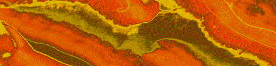

```{r echo = FALSE, out.width = "100%"}   
    
```
<small>
<br>
<i>abstract</i> 
by matthew venn is licensed under 
<a href="https://creativecommons.org/licenses/by-sa/2.0/">CC BY-SA 2.0</a>
<br>
</small>

# Portfolio of data displays 
Nick Harrelson
`r Sys.Date()`

##Introduction 

This portfolio is being made to satisy requirements for ME477 Visualizing Data taught at Rose-Hulman Institute of Technology. The goal of the course is to be able to create effective, truthful visuals with the aide of R and Rstudio. 

## Displays and critiques 

[Display 1](reports/d1.md) Wine Reviews

This is a boxplot made to assist novice wine drinkers with purchasing quality wine based on continent and price.

[Display 2](reports/d2.md) California Agricultural Commodities

This is a multiway plot investigating the effects of drought on Californian agricultural markets.

[Display 3](reports/d3.md) Does money buy happiness?

Investigating the ties between hapiness and GDP of nations using faceted scatter plots.

[Display 4](reports/d4.md) Oral Cancer

[Display 5](reports/d5.md) Graphical lie

[Display 6](reports/d6.md) Multivariate

## Discussion notes 

[Reading responses](reports/reading-responses.md) Notes from the data graphics literature on elements of design and visual rhetoric. 

[Presentation prompts](reports/presentation-prompts.md) Prompts that question the decisions made during the creation of each visualization.

[Reflections on rhetoric](reports/rhetoric_reflections.md) Reflection on the ideas of data journalists in discovering stories.