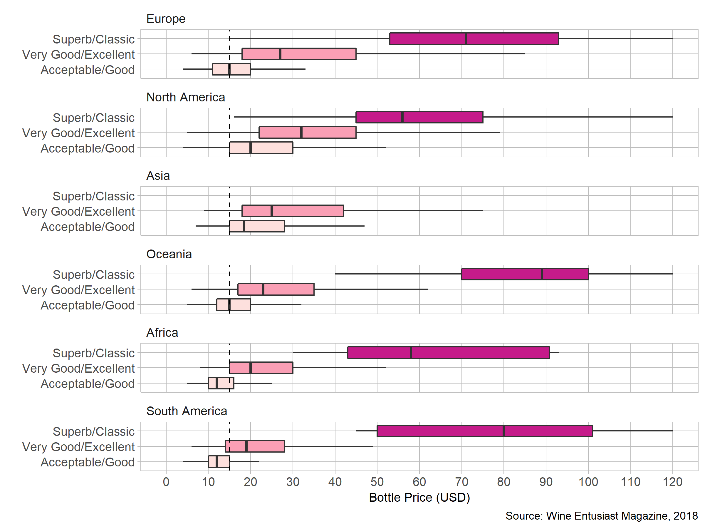

## Introduction  

This display illustrates the distribution of Wine prices across different 
levels of quality and continents of origin. 

## Requirements 

This display meets the data requirements for D1 distributions

- 137,221 observations 
- One quantitative variable (price)
- Two categorical variables: quality (3 levels) and continent (6 levels)  

## Prose

```{r setup, echo=FALSE}
library("knitr")

```
Display 1: Boxplot of Wine Enthusiast Magazine reviews.


Personally, I have only been drinking wine for about the last year and although I have started being able to taste some differences between wines I am absolutely clueless when it comes to buying it. Most of my purchases are made from the reccomendations of friends or, for better or worse, guessing and checking. Recently, I expressed this to my friend's father and he sugested I try some South American wines because "you can get some stellar South American blends for only $15." I wanted to be able to confirm this theory as well as make a plot that new wine drinkers could use to generally direct their purchasing choices. 

Our dataset is a collection of wine reviews compiled by Wine Enthusiast Magazine. The reviews are all made by writers and editors for the publication. We have a few variables of interest, such as:

- Price of the bottle
- Country of origin 

The dataset also originally included a quantitative variable: points, the score assigned to a wine out of a possible 100 points. I wanted to make this data easy to interpret for the novice, so i chose to forgo a scatter plot (with price v points) and instead grouped the score variable into the categorical variable: quality. This makes it easier for the user to interpret as it is a much easier calculation for the computer to handle ahead of time [@Robbins2013a, 217]. I originally grouped the scores by the median, separating them into "Good" and "Bad" wines, but after reading [this](https://www.winemag.com/2010/04/09/you-asked-how-is-a-wines-score-determined/) article from Wine Enthusiast, I decided to go with the following grouping scheme.

```{r table, echo=FALSE}
tb <- data.frame('Quality'=c("Superb/Classic","Very Good/Excellent","Acceptable/Good"),"Score Range"=c('97-100','87-96','80-86'))
kable(tb, col.names = c("Wine Quality","Range of Review Points"))
```

I also replaced country of origin with continent of origin. We can now more easily see any general trends as well as allowing us to test the claims of my friend's father. 

The continents are reordered based on the median wine price within each continent. Placing the most expensive at the top allows the reader to intuitively interpret the plot [@Robbins2013a, 161].

The tick mark intervals were chosen based on what would be relevant for a consumer purchasing wine in the store. Initially, I chose \$5 increments, but this crowded the plot too much for my liking. As a compromise I went with \$10 intervals to keep it relevant, but also to reduce the number of lines and make the data stand out better [@Robbins2013a, 183].

I chose to omit outliers from the plot based on the size of the outliers and the intended audience. The most expensive wine reviewed in the dataset was approximately \$2000, which increased the width of the plot considerably. This made it harder to view the boxes and whiskers accurately, where most of the data and story is located. In addition, this plot is being made for people new to drinking wine. They generally aren't interested in buying the most expensive bottle, let alone a \$2000 one, they want to explore options on a budget. 

The colors used to fill wine quality are on a gradient, this helps indicates an increase in quality between the groups [@RostLC2018a]. The better wine being displayed in a darker red/purple, while the lesser wines are in increasingly pale colors.

Examining the plot, we can immediately see the separation in price between the different qualities of wine, as well as where they overlap. European wines are the most expensive in general, but we see that all superb/classic bottles of wine are generally around the same price regardless of continent. 

I added a vertical line at the $15 point to help aide the comparison my friend's father proposed. I would say his remarks were correct.

- \$15 brings us into the 2nd quartile of the very good/excellent South American bottles. While also being outside of the middle 50% of acceptable/good category. 
- For other continents, \$15 is in the lower half of the acceptable/good category
    + Except Africa, \$15 is in the upper portion of acceptable/good and right on the first quartile of very good/excellent. African wine is only slightly behind South America in terms of value. 
    
I wouldn't let this plot discourage you from buying cheaper European or North American bottles. As you can see, there are still very good/excellent bottles from either continent at the \$15 price range. However the random odds aren't in your favor, this is where experience/reccomendations come into play.  

## References

<div id="refs"></div>
