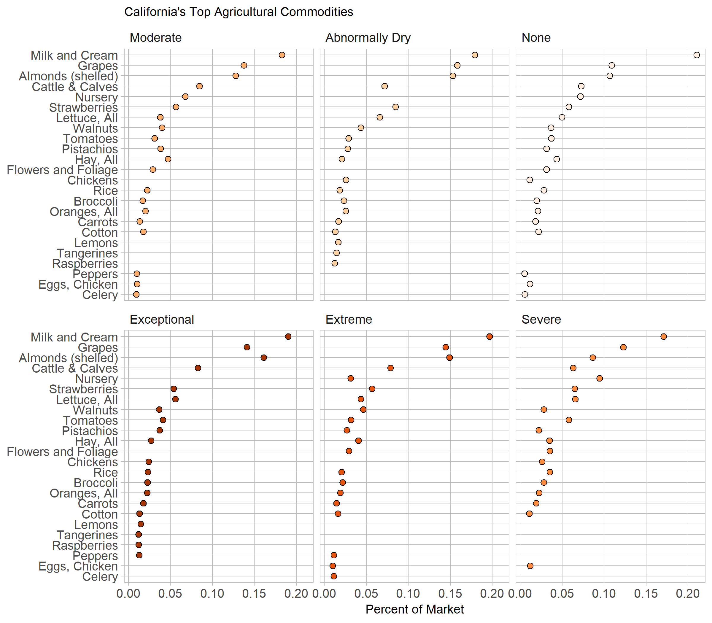

## Introduction  

This display shows the percent of market share that different agricultural commodities hold throughout varying conditions of drought in California. 

## Requirements 

This display meets the data requirements for D2 multiway

- 119 observations 
- One quantitative variable (percent of market) 
- Two categorical variables: drought intensity (6 levels, ordinal) and commodity (24 levels, nominal) 
    + 6*24 != 119 because not all commodities made it into the top 20 of each year, California only reports the top 20 commodities.

## Prose

```{r setup, echo=FALSE}
library("knitr")

```
*Display 2: California's top commodities during drought.* 

I was interested in seeing how droughts affect the agriculture of a region, specifically California. California is one of the largest producers of food in the United States, producing 13% of total commodities in 2015. The state is also notorious for having primarily been in a drought the last 20 years. This makes it a prime candidate to study how the lack of water affects the agricultural economy. 

Data was acquired from the California Agricultural Statistics Review, an annual report by the California Department of Food and Agriculture. Revenue data for years in each drought condition were collected. This data allowed us to compute what percentage each commodity made up of the overall agricultural market. 

The colors were chosen to be on a gradient due to the drought conditions being ordinal categories from low to high [@RostLC2018a]. Darkening reds were chosen to match the worsening drought conditions, while the normal conditions were relatively pale. The facets were ordered in the same order of the drought conditions. 

The commodities are sorted based on the median value of the percents of market [@Robbins2013a, 200]. This allows the reader to utilize the multiway plot correctly, being able to see where points deviate from an expected trend relative to the other points. For example, in exceptional droughts we see that almonds make up a disproportionately large share of the market. Similarly, we see that in extreme drought nurseries make up a disproportionately small share of the market. Predictably, looking forward to exceptional droughts, nurseries leave the top twenty commodities all together. 

Other trends become apparent, such as the tendency to plant citrus fruits (lemons and tangerines) in times of drought. We also notice the overall distribution of the market shares in each drought condition. As drought gets worse, we see some industries grow their overall share of the agricultural market. Times without drought see a much more even share of the market. For example, in normal conditions almonds make up approximately 7% of the market but in exceptional drought they make up more than 15% of the market. This may be due to the scale of these industries relative to the others, larger industries being able to toughen out the drought more easily than the smaller ones.

## References

<div id="refs"></div>
