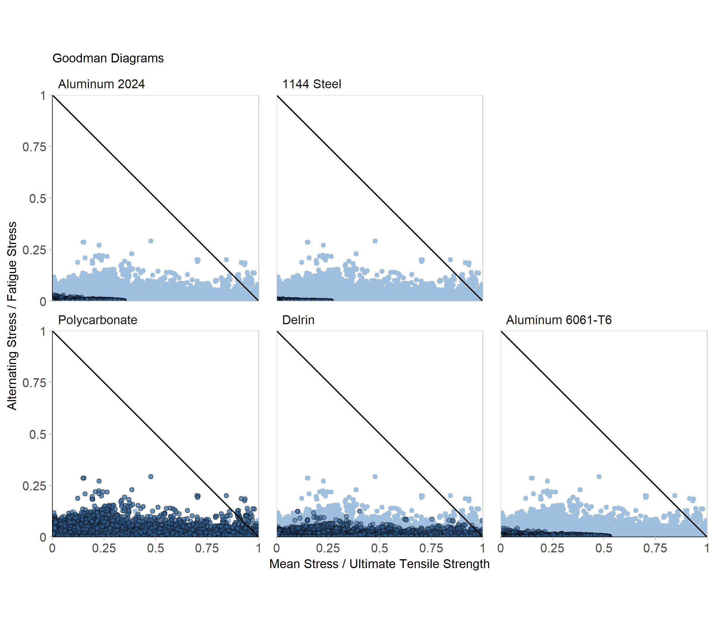

Satisfying the requirements for:

* A scatter plot

Data structure:

* Happiness Index (0-10)
    + Continuous quantitative variable
* GDP (Billions of USD)
    + Continuous quantitative variable
* Populations
    + Continuous quantitative variable
* Region
    + Categorical variable with 9 levels
    

```{r setup, echo=FALSE}
library("knitr")

```