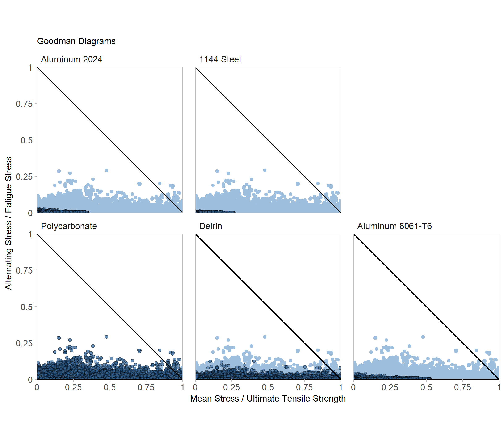

Display 3 - Scatter Plot
================
Nick Harrelson
April 19, 2019

Introduction
------------

This display helps aide the material choice for a machined part with concerns regarding the fatigue life of the component.

Requirements
------------

This display meets the data requirements for D3 scatter plots

-   184,315 observations
-   Two quantitative variables: Mean Stress / Ultimate Tensile Strength and Alternating Stress / Fatigue Stress
-   One categorical variable: material (5 levels)

This display also meets the following document requirements

-   Data in your technical area (this display is one of two)

Prose
-----

This plot was created from data collected in my senior design project. Our client is a manufacturer of electrical connectors, and we are designing a machine to automate their quality testing procedure. As part of our design, we are employing [collets](https://en.wikipedia.org/wiki/Collet) to hold/constrain the electrical connectors. Our initial designs utilized custom collets with all of the geometry defined by us. We considered using stock collets, but we had a reaching size goal (in addition to a more reasonable goal) that stock collets could not accommodate. As this was the first time any of us had designed a collet, we were concerned about the fatigue life of our collet geometry.

We also had to make a choice regarding our material selection. At the time, we started manufacturing the collets from free stock in the machine shop; there were various amount of plastic round stock, some polycarbonate, some delrin. We would like to continue using the free material if possible, saving part of the budget for other components in the project. Otherwise we would need to consider purchasing aluminum or steel stock.

To aide this decision, I conducted a series of finite element analysis simulations. The solutions of which are to be used in a fatigue analysis. To conduct a fatigue analysis, we need a few parameters of interest:

-   Mean Stress
    -   the average stress seen in a component subject to fatigue failure (seen in the diagram below)
-   Alternating Stress
    -   the amplitude of the stress cycle in the component (seen in the diagram below)
-   Ultimate Tensile Strength
    -   material property of the chosen material
-   Fatigue Stress
    -   material property of the chosen material

*Diagram 1: Example of stress cycle in fatigue analysis.*

The mean and alternating stresses are found via the finite element simulation. One simulation corresponds to the minimum load, another corresponds to the maximum load, from here we can solve for the mean and alternating stresses. Due to the nature of finite element simulations, we will have mean and alternating values for every element in the simulation (approximately 35,000 elements per simulation). A different simulation is run for each material choice.

These results are interpreted with the help of a Goodman diagram. The Goodman diagram plots the ratio Mean Stress / Ultimate Tensile Strength on the x-axis, and the ratio Alternating Stress / Fatigue Stress on the y-axis. A diagonal line, named the Goodman line, connecting the points (0,1) and (1,0) indicates where fatigue is likely to occur. A part that is not likely to fail will be near the origin, while parts likely to fail will be across the line. In our case, we will be evaluating the likelihood of each individual simulation element.

 *Display 3: Goodman diagrams for collet material choice.*

I followed Tufte's advice to remove non data ink by removing the grid lines in the background of the plots (Tufte, 1983, 96). The lines didn't add anything when reading the diagrams, as you don't care where exactly the points are. Rather, only how far away they are from the Goodman line comparatively.

I chose to plot the points from the other material choices in a lighter color to show the data within each facet in relation to the other choices available, highlighting the relatively important data within the facet to the less important data as a whole (Charlotte, 2018). This allows you to visually see the comparison between material performance (Doumont, 2009).

The facets are reordered based on both the x and y values, this helps order them by those closest/furthest to the Goodman line. The labels on the scales were simplified to reduce digits and overall chart junk.

I changed the aspect ratios of the plots so that they be square. This make the ends of the Goodman line equidistant from the origin, a convention followed in many other Goodman plots. It also places the line at a 45 degree angle, aiding the comparison to the points.

From the diagrams, we can easily see that 1144 steel is the best choice for the application. The points plotted for steel are significantly further away from the Goodman line than the next best material, aluminum 2024. Unfortunately, we see that both of our plastic options would be susceptible to fatigue failure. The points being much more spread apart, and even crossing the Goodman line in some areas. If we were to go any further with this design, we would need to purchase either aluminum or steel stock.

Unfortunately, the design never got that far. We ran into a variety of other issues regarding the manufacturing of the collets and decided meeting the reaching goal was not worth the time investment. Instead we met the more reasonable size goal with the implementation of standard collets, reducing our manufacturing time considerably.

References
----------

Charlotte L (2018) What to consider when choosing colors for data visualization. <https://blog.datawrapper.de/colors/>

Doumont J-L (2009) Designing the graph. *Trees, maps, and theorems: Effective communication for rational minds*. Principiae, Kraainem, Belgium, 133–143 <http://www.treesmapsandtheorems.com/>

Tufte E (1983) The visual display of quantitative information. Graphics Press, Cheshire, CT, 16–31 <https://www.edwardtufte.com/tufte/books_vdqi>
