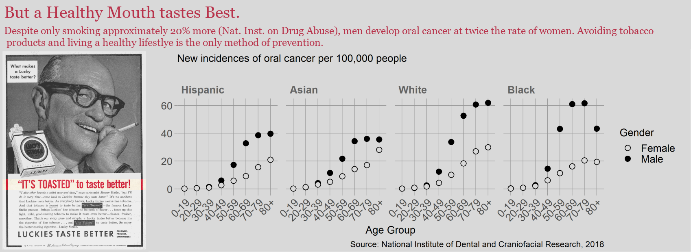

## Introduction  

This display illustrates the differing rates of oral cancer incidence between men and women across races. Men experience a much greater risk than women despite smoking rates.

## Requirements 

This display meets the data requirements for D3 injuries/fatalities

- 96 observations 
- One quantitative variable (rate per 100,000) 
- Three categorical variables: gender (2 levels), age (8 levels), and race (4 levels) 

## Prose

```{r setup, echo=FALSE}
library("knitr")

```

*Display 4: Rates of oral cancer.*

My girlfriend is a survivor of oral cancer and the fact that she ever got oral cancer in the first place is extremely strange for a then 18 year old female who doesn't smoke. I was curious as to how rare it was for her to get cancer compared to other age/sex [@Doumont2009]. Data regarding oral cancer rates was obtained from the National Institute of Dental and Craniofacial Research.

The facets are ordered by increasing risk allowing us to easily compare two different races [@Robbins2013a, 200]. We immediately notice the difference in rates between hispanics/asians and whites/blacks, the former peaking at rates of 40 per 100k while the latter peaks at 60 per 100k. This may be due to differing rates of smoking between races.

We also notice the difference in rates between males and females, being similar up until our 40s when the rate in men increases significantly compared to women. I tried to accommodate for different rates of smoking between sexes, by multiplying the female rate of cancer by the difference in smoking rate. I then plotted these values using a different marker from the main male/female markers to distinguish it differently [@Robbins2013a, 167]. These markers are smaller than the other markers, so I added a discontinuous line to help see the trend better.  

I changed the axes labels such that only the upper limit of each age group was shown, this reduces the chart junk. I chose to keep the grid lines despite Tufte's advice to reduce non data ink, in order to aide the comparison between points[@Tufte, 96]. I thought the aspect ratio made it difficult to line up points by eye without them.  

The photo was chosen to remind readers about the patients behind the data. I didn't want to choose a photo of a disfigurement resulting from cancer, as I think the reader would see this as an extreme case and as a result not relate to it as much. This photo is very simple, not distracting, and shows the concern on the man's face as he contemplates the feeling in his throat. This introduces a human element to the data [@DraggaVoss, 271]. The font color from the heading is sampled from the red on the man's throat, visually tying the photo to the other elements in the graphic. The grey from the photo's background is used in the rest of the graphic to maintain continuity between image, as well as maintain the somber tone.

Looking at the plots, its pretty astounding my girlfriend got cancer in the first place, relative to other groups. Then again, I realize that even 60 people (the highest rate seen) getting oral cancer out of 100k people is also incredibly rare. Either case is unfortunate but people should be aware of some of the preventable leading causes such as smoking. 

## References

<div id="refs"></div>