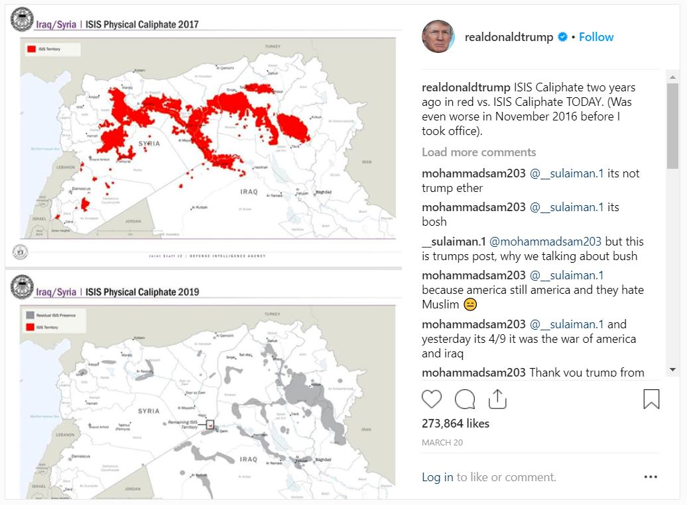
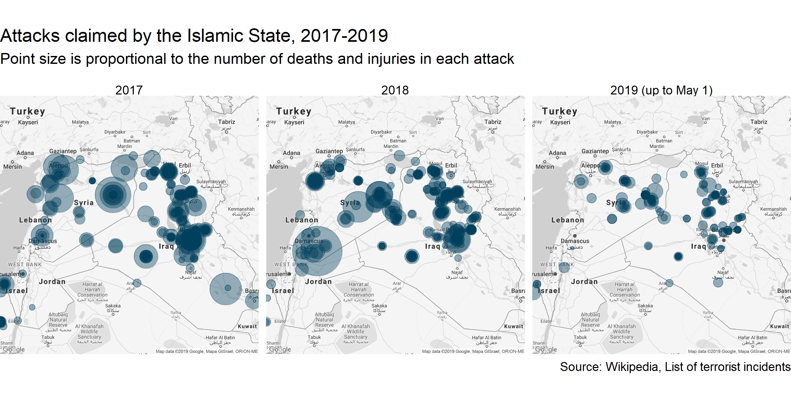

## Introduction   

This display redesigns a map posted on President Trump's Instagram account. The map attempted to show the decline of the ISIS caliphate. 

## Requirements 

This display meets the data requirements for D5 graphical lie redesign

- 331 observations 
- Three quantitative variables (latitude, longitude, HarmLevel) 
- One categorical variable: perpetrator (2 levels)  

This display also meets the following document requirements 

- A compelling story

## Prose

On March 20, 2019 President Trump claimed that ISIS would be lose its remaining territory in Syria "by tonight." The president referring to a map, later posted on his Instagram account. 

```{r setup, echo=FALSE}
library("knitr")

```

However this [wasn't the first time](https://thehill.com/policy/defense/435402-16-times-trump-declared-or-predicted-the-demise-of-isis) the president has claimed victory over the terror group. It looks like the president really wants us to know that it was him who solved the problem of the Islamic State once and for all. But looking at the map a little more in detail, I noticed some attributes that led me to question the plot's truthfulness:

* Changing color scheme
    + The president's map includes a legend describing the color scheme, but the scheme changes between the 2017 and 2019 facets. In 2017, ISIS territory is shown in red, encompassing most of the region shown. In 2019 the scheme again uses red to denote ISIS territory, now only taking up a minuscule dot in the center. It also uses a dark grey to represent "Residual ISIS Presence." What does residual ISIS presence even mean? Is this any more than a changing definition to skew the data? Honestly, I can't be entirely sure due to lack of access to the data from the Defense Intelligence Agency. 
    + Looking at the grey used makes me believe it was selected only to blend into the map (Wainer, 2000, 16). As someone who isn't familiar with the geographies of Iraq and Syria, I thought these were bodies of water at first glance. 
    + Red is also a poor choice of color considering the cultural and emotional baggage associated with it (associations with blood, murder, etc.).
* Selection of Years
    + This isn't the biggest offense as I understand the map was designed to be posted on Instagram, and you can only convey so much information at once. But a  better graphic would include data from 2018 to show the entire progression. 

When redesigning this graphic, I was initially discouraged since I did not have access to the original data. But I eventually used this to my advantage due to the questionable definition of "territory." While reading about the Islamic State, I learned the caliphate is enforced in a very tribal manner, ruling  with fear and enforcing it with sights such as public beheadings. If this is the case, we can get an understanding of where the state has influence by looking at where attacks are made. In addition, these attacks are one of the top issues with terror groups making them a variable of interest in gauging how large of a problem the groups are. Problems the president has claimed to fix.  

```{r middle, echo = FALSE}

```

In this redesign, each point is a separate attack claimed by the Islamic State. Dark blue was chosen as the point color in order to make them stand out from the grey map [@Robbins2013a, 163]. The choice of blue also helps maintain the somber tone associated with the data source. The size of each point is proportional to the HarmLevel, a variable I computed as #Deaths + 1/2 #Injuries, to be able to capture the extent of the attack in one dimension. 2018 was added for context purposes, and it should be noted that 2019 is incomplete. A few takeaways from this plot:

* Between 2017 and 2018, some areas got worse, others got better. Not much change overall unfortunately. 
* It appears attacks in Damascus, Syria have subdued in 2019. 
* Large scale attacks in the region seem to have lowered in frequency in 2019, although only a third of the year has passed. It's somewhat hard to gauge in this plot, but it looks as if the rate of attacks is consistent if not slightly lower. 
    + Note that these attacks are occurring in the original graphic's "residual ISIS presence" zones. 

While this certainly is an improvement from the original map, we can still do better. First, we have no firm idea of how many people are affected by these attacks. We can guess by looking at the size of the dots, but a concrete number would be more effective. Second, why are we only looking at this region of the globe? ISIS operates on a global basis regardless of it's region of origin; we are essentially limiting what data is shown [@Wainer2000, 12].

```{r world, echo = FALSE}
include_graphics("../figures/d5.png")
```

This is my most recent version of the graphic, and it tells a much larger story. Most notably, the addition of the Boko Haram group. I was not very familiar with the group prior to this redesign, but I had heard the name. For those not familiar, Boko Haram is a subset of the Islamic State based in North Africa, focusing their efforts on the [destruciton of the Nigerian state.](https://www.cfr.org/blog/isis-al-qaeda-and-boko-haram-faces-terrorism) The colors denoting the two groups were chosen with the aide of a color blindness simulator, making sure the groups could be distinguished across a variety of types of colorblindness [@RostLC2018a].

In addition, the bar graphs show the injury and death counts from each year, reminding us all of the important implications of attacks [@DraggaVoss, 269]. To allow for comparison with 2019, I showed the totals so far as well as the projected yearly totals. These totals were calculated by assuming the attack rates continue as they do now.

Some observations:

* Attacks in Europe and Australia have been absent in 2019 thus far.
* The attack in Sri Lanka in April 2019 is the deadliest attack in this time span. 
* Death/Injury counts are pretty consistent between 2017 and 2018, but there is a significant drop (at least in the projected numbers) in 2019. 
* Notice the presence in East Asia, specifically Indonesia and the Philippines. 
* It appears there are two centers of activity in the middle east. One centering around Syria/Iraq, the other around Afghanistan/Pakistan. This was not visible in the previous maps.

Overall, I think it's fair to say the overall threat has shrunk somewhat. But I also think the president is misleading the public by claiming the group is defeated. The state is still attacking and keep in mind only a third of the projected deaths in 2019 have actually happened so far. Who better wants to make their presence known than a falsely marginalized terrorist group?

## Resources

<div id="refs"></div>

