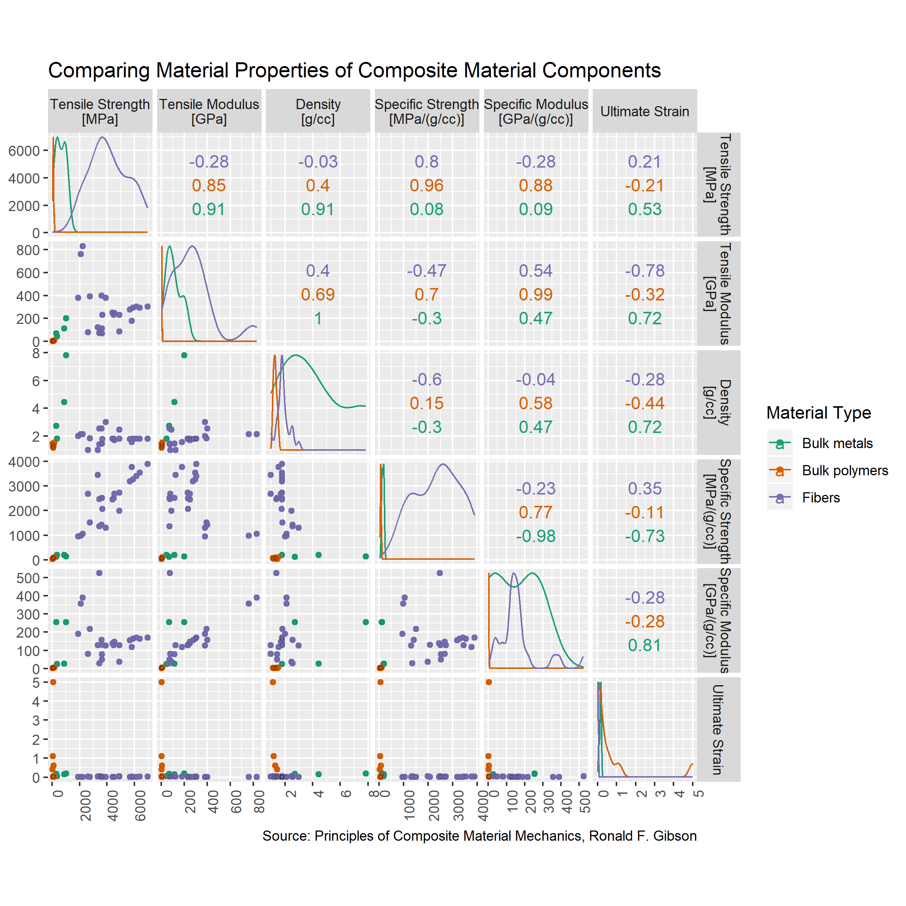

## Introduction  

This display examines material properties of common composite material components. Composite materials are generally used in applications where stiffness/strength is critical while also minimizing weight. 

## Requirements 

This display meets the data requirements for D6 multivariate

- 44 observations 
- Six quantitative variables: tensile strength, tensile modulus, density, specific strength, specific modulus, ultimate strain.  
- One categorical variable: material type (3 levels) 

This display also meets the following document requirements 

- Data in your technical area (this display is two of two) 

## Prose

```{r setup, echo=FALSE}
library("knitr")

```

*Display 6: Scatterplot matrix detailing different material properties of common composite materials*

I used a data set containing material properties of common composite materials from a textbook about composite material mechanics. Commons metals are included under "bulk material" to act as a reference for those unfamiliar with more advanced materials in order to see how they differ [@Doumont2009]. In the scatter plot matrix, each quantitative variable is represented on an axis and combined with an axis from every other quantitative variable. 

A few observations regarding the data:

- Fibers are what give composites their extreme strength to weight ratios.
    + Much higher tensile strengths and tensile moduli than bulk metals. This is expected due to the relatively small cross sections of the fibers, as the fibers decrease in diameter their tensile strength increases exponentially. The metals simply can't compete.
    + The strength to weight ratios and stiffness to weight ratios are visible in the specific strengths and specific moduli respectively. Fibers are biased towards the y-axis, while metals are biased towards the x-axis (for the plots with density on the x-axis) indicating the difference in relative strength/stiffness.
- Bulk polymers are primarily used as matrix materials in composites. These materials are used to hold the fibers in place relative to each other, as well as protect them from their environment.
    + This explains why the bulk polymers are the only materials with considerable ultimate strains. All other materials have a much smaller ultimate strain closer to 0.
    + Since they are not the primary component of strength in composite materials, they are conversely at the low end of all other metrics. 

Comparisons between two quantitative variables is helpful, but I really like the plots showing the distribution of the individual variables by types along the scatter plot diagonal. This does a great job at showing where the data is commonly occurring for the given material types. 

## References

<div id="refs"></div>
