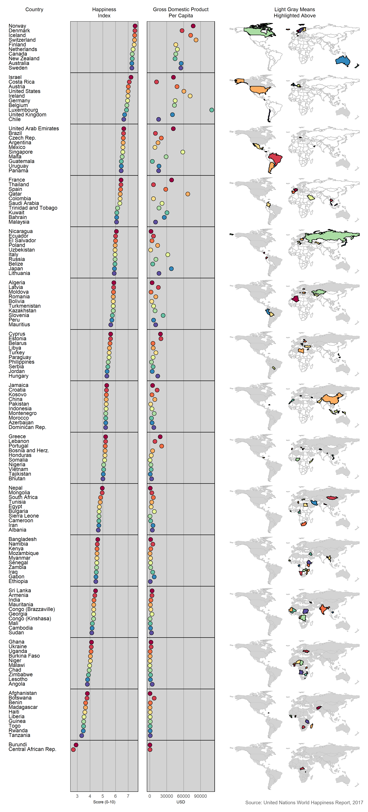

Display 7 - Linked Micromap
================
Nick Harrelson
May 17, 2019

Introduction
------------

This display illustrates the relation between happiness index, GDP per capita, and geographical location of different countries. Geographical locations are denoted with a linked micro-map.

Requirements
------------

This display meets the data requirements for D7 self-taught

-   142 observations
-   Two quantitative variable (Happiness Index and GDP per Capita)
-   One categorical variable: country (142 levels)

Prose
-----

*Display 7: Linked micromap relating happiness to GDP per capita.*

The United Nations releases the World Happiness Report annually, ranking the relative happiness of countries out of a possible 10 points. I combined this data set with GDP and population data to create the above linked micro-map.

Countries are sorted based on the value of their happiness index (Robbins, 2013a, 200). Countries were grouped into groups of 10 countries per facet. This was chosen considering the large number of observations as well as how cluttered the micro-maps appeared. I was less concerned with the number of colors because I wasn't as concerned with identifying countries on the map as much as I was with seeing the general regions of the world the countries appear in. Between the facets, the previously highlighted countries are progressively colored in grey.

Looking at the distinct regions, we immediately notice that the happiest countries are the most northern and southern ones, closest to the poles. The next micro-map, containing the second set of ten countries, features countries relatively closer to the equator but still far north/south. The least happy countries are unsurprisingly primarily in Africa and South Asia.

I ignored Tufte's advice to remove non-data ink by keeping the grey background on the dot plots (Tufte, 1983, 96). I thought this grey helped link the grey in the micro-maps to the rest of the frames in the plot.

I chose to use GDP per capita as my second quantitative variable as opposed to just GDP. This accounts for population in each of the countries and, in my opinion, tells us the more interesting story. The lower 50% of happy countries all have about the same GDP per capita, money is not affecting the difference in happiness between these countries. As we get into the upper 50% of happy countries, happiness starts to trend with GDP per capita. It appears that once you are so happy, the only thing that will increase your happiness further is generally money.

References
----------

Robbins N (2013a) General principles for creating effective graphs. *Creating More Effective Graphs*. Chart House, Wayne, NJ, 154–225 <http://www.nbr-graphs.com/resources/recommended-books/>

Tufte E (1983) The visual display of quantitative information. Graphics Press, Cheshire, CT, 16–31 <https://www.edwardtufte.com/tufte/books_vdqi>
